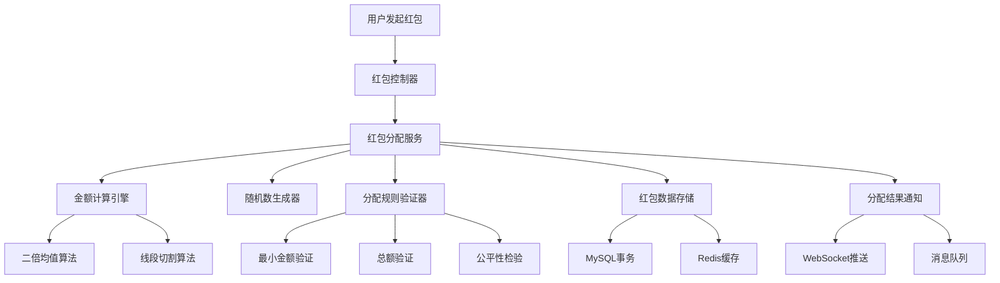
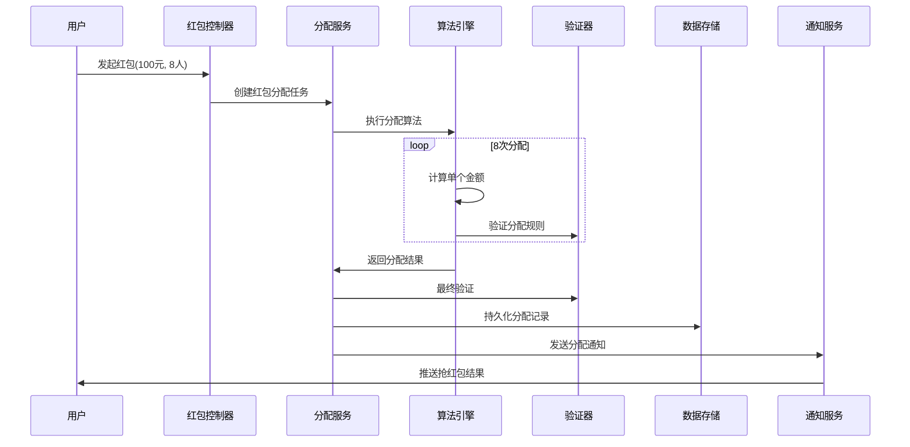
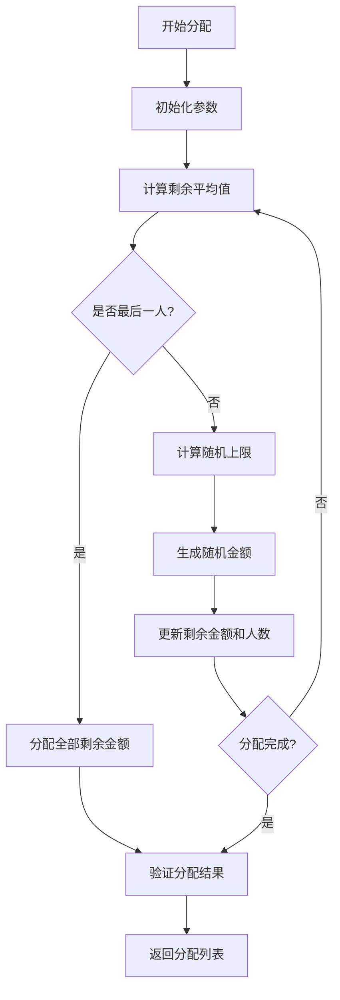
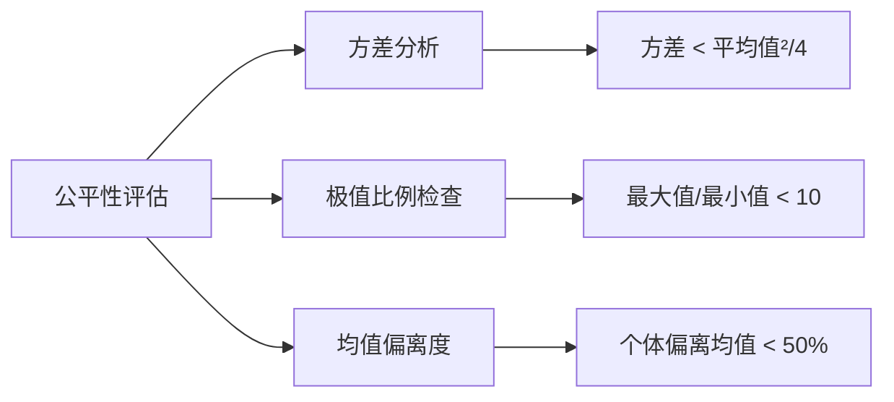
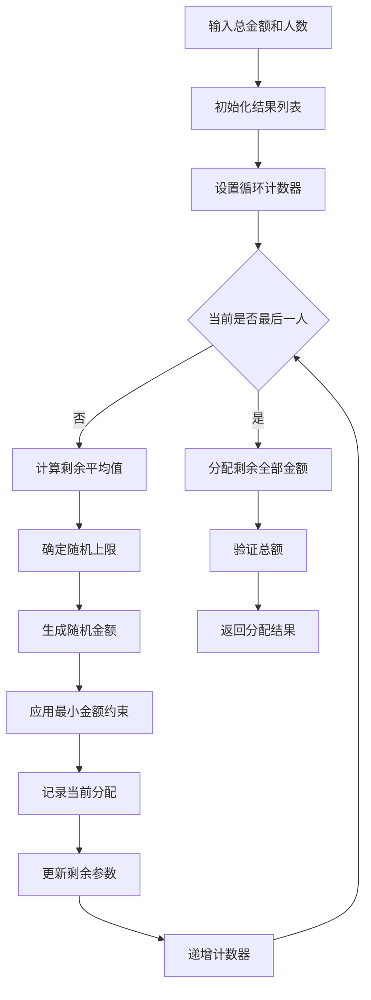
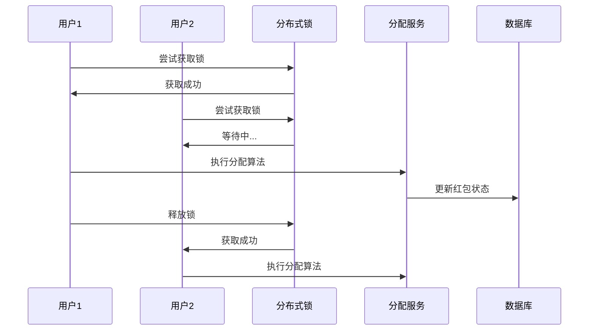
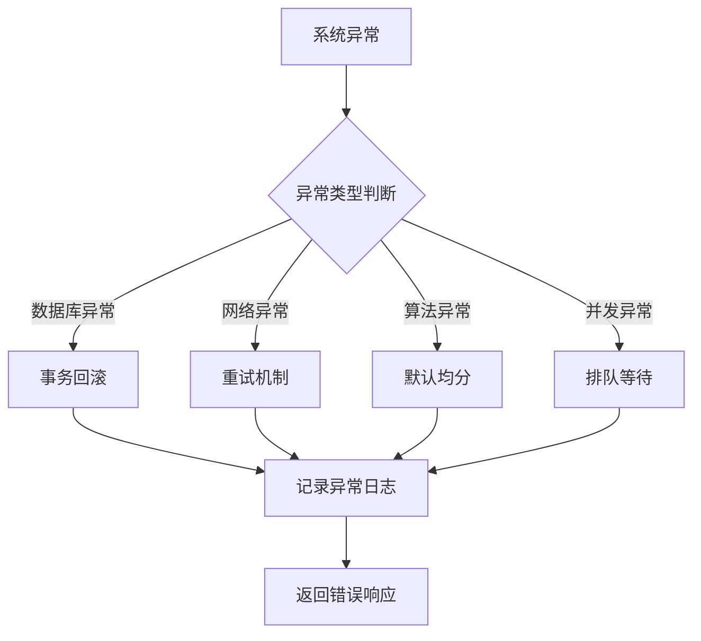
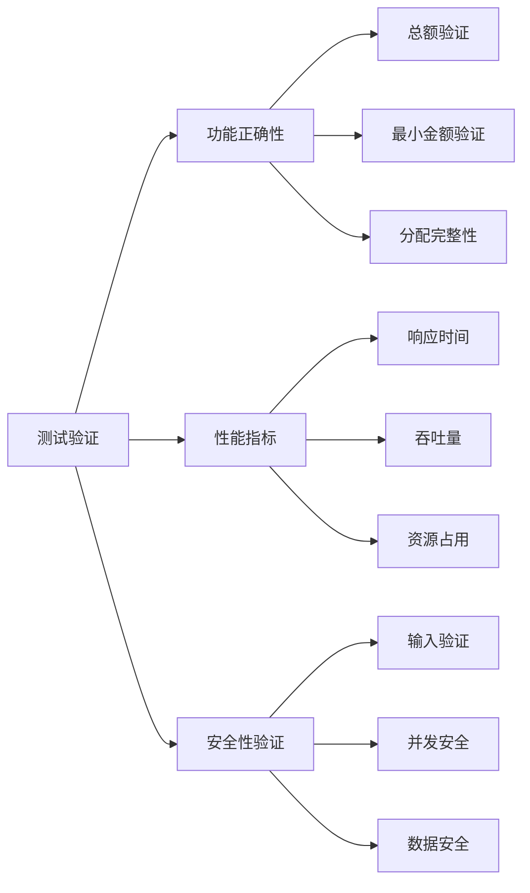

# 红包分配算法设计

## 概述

设计一个公平、随机的红包分配算法，将100元红包分给8个人抢夺。算法需要保证每个人至少能分到最小金额，同时保持随机性和用户体验的公平感。

### 核心目标
- 总金额精确分配，无遗漏无超额
- 每个人至少获得最小保障金额  
- 分配结果具有随机性和不可预测性
- 避免出现极端分配（某人分到过多或过少）
- 算法执行效率高，适合高并发场景

## 架构设计

### 系统组件架构

### 数据流设计

## 算法设计方案

### 方案一：二倍均值随机算法（推荐）

#### 算法原理
基于剩余金额的二倍均值作为随机上限，确保后续用户仍有合理金额可分配。

#### 核心逻辑
- 计算剩余平均值：remainAvg = remainAmount / remainCount
- 随机范围：[最小金额, min(remainAmount, 2 * remainAvg)]
- 特殊处理最后一个用户：直接分配剩余全部金额

#### 算法参数配置

| 参数名称 | 取值 | 说明 |
|---------|------|------|
| 总金额 | 100.00元 | 红包总价值 |
| 分配人数 | 8人 | 参与抢红包用户数 |
| 最小金额 | 0.01元 | 每人最少分配金额 |
| 最大倍数 | 2.0 | 平均值的最大倍数限制 |
| 精度单位 | 分（0.01元） | 金额计算精度 |

#### 分配流程设计

### 方案二：线段切割算法

#### 算法原理
将总金额视为一条线段，通过随机切点将其分割成多段。

#### 实现步骤
1. 生成 n-1 个随机切点（0到总金额之间）
2. 对切点进行排序
3. 计算相邻切点间的距离作为分配金额
4. 调整确保每段至少为最小金额

#### 优缺点对比

| 算法方案 | 优点 | 缺点 | 适用场景 |
|---------|------|------|----------|
| 二倍均值算法 | 分配均匀、实现简单、性能好 | 随机性相对较弱 | 高并发、用户体验要求高 |
| 线段切割算法 | 随机性强、数学严谨 | 实现复杂、可能出现极值 | 随机性要求极高的场景 |

## 分配规则与约束

### 基础约束条件

| 约束类型 | 规则描述 | 验证方式 |
|---------|----------|----------|
| 金额总和 | 所有分配金额之和 = 总金额 | 累加验证 |
| 最小保障 | 每人分配金额 ≥ 0.01元 | 逐个检查 |
| 精度控制 | 金额精确到分（小数点后2位） | 数值格式验证 |
| 非负性 | 所有分配金额 > 0 | 范围验证 |

### 公平性保障机制

#### 分配公平性指标

#### 异常分配处理

| 异常情况 | 检测标准 | 处理策略 |
|---------|----------|----------|
| 极端分配 | 单个金额 > 均值的3倍 | 重新生成随机数 |
| 零分配 | 分配金额 = 0 | 强制分配最小金额 |
| 精度错误 | 总和与目标金额不符 | 调整最后一位分配 |

## 数据模型设计

### 红包实体模型

| 字段名称 | 数据类型 | 约束条件 | 描述 |
|---------|----------|----------|------|
| red_packet_id | VARCHAR(32) | PRIMARY KEY | 红包唯一标识 |
| total_amount | DECIMAL(10,2) | NOT NULL | 红包总金额 |
| total_count | INT | NOT NULL | 红包总份数 |
| remaining_amount | DECIMAL(10,2) | NOT NULL | 剩余金额 |
| remaining_count | INT | NOT NULL | 剩余份数 |
| create_time | DATETIME | NOT NULL | 创建时间 |
| status | TINYINT | NOT NULL | 红包状态 |

### 分配记录模型

| 字段名称 | 数据类型 | 约束条件 | 描述 |
|---------|----------|----------|------|
| allocation_id | VARCHAR(32) | PRIMARY KEY | 分配记录ID |
| red_packet_id | VARCHAR(32) | FOREIGN KEY | 关联红包ID |
| user_id | VARCHAR(32) | NOT NULL | 用户ID |
| amount | DECIMAL(10,2) | NOT NULL | 分配金额 |
| allocation_order | INT | NOT NULL | 分配顺序 |
| allocation_time | DATETIME | NOT NULL | 分配时间 |

### 缓存数据结构

#### Redis Key设计

| Key模式 | 数据类型 | TTL | 用途 |
|---------|----------|-----|------|
| redpacket:info:{id} | Hash | 24小时 | 红包基础信息 |
| redpacket:allocations:{id} | List | 24小时 | 分配结果列表 |
| redpacket:lock:{id} | String | 30秒 | 分配操作锁 |

## 算法实现设计

### 核心分配算法

#### 二倍均值算法实现逻辑

#### 随机数生成策略

| 生成方式 | 特点 | 适用场景 |
|---------|------|----------|
| 伪随机数生成器 | 速度快、可重现 | 开发测试环境 |
| 安全随机数生成器 | 不可预测、安全性高 | 生产环境 |
| 硬件随机数 | 真随机、性能较低 | 极高安全要求 |

### 性能优化设计

#### 并发控制机制

#### 性能指标要求

| 指标类型 | 目标值 | 监控方式 |
|---------|-------|----------|
| 响应时间 | < 100ms | APM监控 |
| 并发处理 | 1000 TPS | 压力测试 |
| 内存占用 | < 10MB | 内存监控 |
| CPU使用率 | < 30% | 系统监控 |

## 边界情况处理

### 异常场景设计

#### 输入参数异常

| 异常类型 | 检测条件 | 处理策略 |
|---------|----------|----------|
| 金额为零 | totalAmount ≤ 0 | 抛出参数异常 |
| 人数无效 | count ≤ 0 | 抛出参数异常 |
| 金额不足 | totalAmount < count × minAmount | 提示金额不足 |
| 精度溢出 | 计算结果超出精度范围 | 精度截断处理 |

#### 系统异常处理

### 容错机制

#### 分配失败恢复策略

| 失败阶段 | 恢复方式 | 数据一致性保障 |
|---------|----------|----------------|
| 算法计算失败 | 重新计算 | 无状态计算，无需恢复 |
| 数据写入失败 | 事务回滚 | 数据库事务保障 |
| 通知发送失败 | 异步重试 | 消息队列保障 |

## 测试策略

### 单元测试设计

#### 测试用例覆盖

| 测试类别 | 测试场景 | 验证内容 |
|---------|----------|----------|
| 正常分配 | 标准参数输入 | 总额准确、最小金额保障 |
| 边界测试 | 极值参数输入 | 异常处理、参数验证 |
| 随机性测试 | 多次重复执行 | 结果分布合理性 |
| 性能测试 | 高并发场景 | 响应时间、资源使用 |

#### 验证指标体系

### 压力测试设计

#### 测试场景规划

| 测试类型 | 并发用户数 | 持续时间 | 期望结果 |
|---------|-----------|----------|----------|
| 基准测试 | 100 | 5分钟 | 建立性能基线 |
| 负载测试 | 500 | 10分钟 | 验证设计容量 |
| 压力测试 | 1000 | 15分钟 | 确定系统极限 |
| 峰值测试 | 2000 | 5分钟 | 验证突发处理能力 |